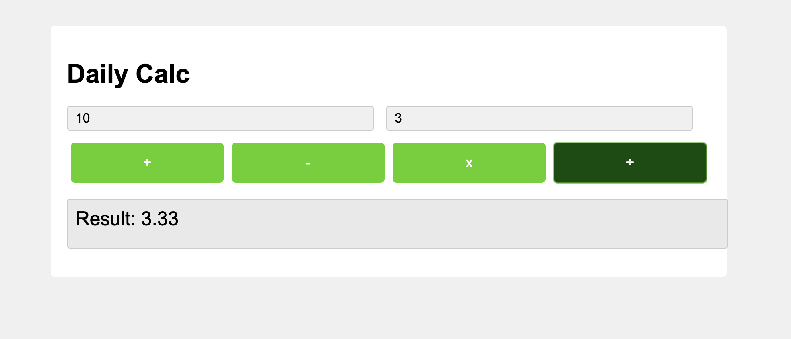

# Daily-Calculator

一个简单快捷的日常计算器，为紧急且重要的计算需求设计。当您需要快速计算一些不复杂但重要的数值时，这个工具可以高效地满足您的需求。

---

## 项目概述
- Daily Calculator 是一个轻量级的网页计算器应用，专为日常快速计算设计。界面简洁直观，操作便捷，无需安装即可使用。
- 当用户的鼠标扫到按钮的时候，按钮变深绿色，且鼠标变成卡通的“手指”形象。

---

## 功能特点
- **基础运算**：支持加法(+)、减法(-)、乘法(×)和除法(÷)四种基本运算
- **错误处理**：智能检测除数为零的情况，并显示友好的错误提示
- **浮点数支持**：精确处理带小数点的计算结果
- **响应式设计**：适配不同设备屏幕尺寸
- **直观界面**：清晰的输入框和结果显示区域

---

## 技术实现
本项目采用了前端三大核心技术：

### HTML5
- 构建页面结构
- 使用语义化标签提高可访问性

### CSS3
- Flexbox布局技术实现按钮的均匀分布
- 过渡动画增强按钮交互体验
- 自适应设计确保在不同设备上的良好显示效果

### JavaScript
- 事件处理机制捕获用户输入
- 数值解析和验证确保计算准确性
- DOM操作实现动态结果显示

---

## 代码特色
✅ 模块化设计：计算逻辑独立封装，易于维护和扩展  
✅ 命名规范：采用语义化命名，提高代码可读性  
✅ 异常处理：完善的边界情况处理，如除数为零的检测  
✅ 跨浏览器兼容：确保在主流浏览器中正常运行

---

## 使用方法
1. 在第一个输入框中输入第一个数字
2. 在第二个输入框中输入第二个数字
3. 点击相应的运算符按钮（+、-、×、÷）
4. 结果将立即显示在结果区域

---

## 未来计划
- [ ] 添加更多高级计算功能（如百分比、平方根等）
- [ ] 实现计算历史记录功能
- [ ] 增加键盘快捷键支持
- [ ] 添加暗色模式选项

---

## 相关技能展示
该项目体现了以下前端技能：
- HTML5/CSS3/JavaScript 基础技术栈
- 响应式布局和自适应设计
- DOM操作和事件处理
- 用户输入验证和异常处理
- 前端性能优化考量

---

## 联系
如有任何疑问，请联系：lxyxsc999@163.com
